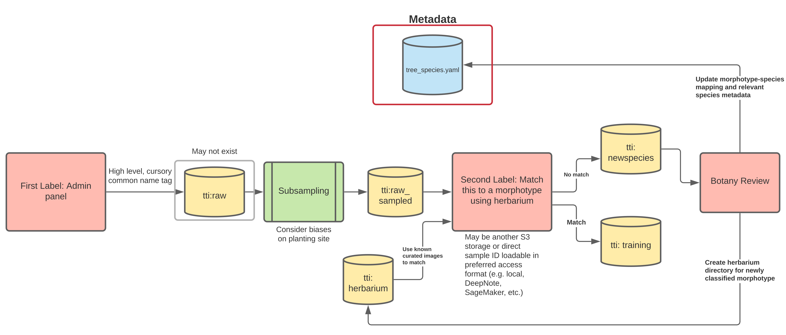

# Building the Machine Learning training dataset

## Background: Species names

Humans use two kinds of names to label biological species: ‘common
names’ (aka ‘folk names’) and ‘scientific names’. Examples of common
names are “oak”, “maple”, “croton”. Common name classes often contain
several biological species. Scientific names are binomials: a _genus_
name and a _species_ name (and sometimes a third, _subspecies_ or
_variety_ name), e.g., _Croton megalocarpus_. Scientific names are
usually italicized. To be complete, an authority is added to the name:
‘_Croton megalocarpus_ Hutch.’: Hutchinson was the original author of
the name.

Sometimes it can be hard to be sure of the correct species name,
especially when only looking at images. In these cases a _morphotype
name_ is coined and applied. In this way we can say that there are
several apparent variants in a dataset, but we do not know the
‘correct’ names for them yet.

It is useful to have a label for each morphotypes in a dataset,
whether or not these have been matched to known species. The label can
be anything (e.g., species 1, 2, 3...), but one useful system is to
use an eight-letter code. If the name is know, the first four letters
are taken from the genus name and second four letters form the species
epithet.  E.g., `CROTMEGA` for _Croton megalocarpus_. A second,
unknown Croton could bet `CROT0001`, and an unknown species could be
`INDE0012` (INDE for “indeterminate”). These labels can be used as
identifiers to cross-reference background information on species in
the [`tree_species.xml`](../tree_species.xml) file. Even if a
morphotype of a previously unknown species is later given a
determination, the label should be preserved unchanged.

## Pipeline for assembling a training set

_Numbers of images_. First, we need to determine an appropriate number
of training images for each species. The more the better, but since
these will be hand-curated, we cannot demand too many. Let’s begin
with a target of 200 images per species. The number of images in the
herbarium should be limited to about 20 for each taxon; extras should
be placed in the training folders.

_Site sampling_. The Greenstand images are of a particular type, that
differ from most images used in machine learning of plants: they are
taken from above, of a plant 10-50 cm tall, which has no fruits or
flowers, and generally include some surrounding soil and/or
vegetation.  Our training set should include these surrounding
elements. The surrounding elements will differ with site: some dry
sites will have only soil in the images, some will have weedy
vegetation. The color of the soil will vary by site, as will the
general geometry and color of the weeds. We therefore should create a
training set with full variation in these background elements if we
are to train the machine learning algorithms to recognize a particular
species from any and every future site. Thus is is important to
subsample the various existing sites in the creation of the training
dataset.

Steps to create each set of images, classed by species:

 1. Many Greenstand images have been preliminarily identified to a
     common name, via the Admin Panel. These determinations appear in
     the `tree_species` field of the database.  
 2.  A ‘raw’ dump of images is made, by:
     1.  SELECTing records from the database by tree_species, including
         the site identifier in the CSV file.
     2.  Subsampling from all the images so as to represent a fixed
         number of images from each site (number determined by: number
         of sites, and desired number of training images).
     3.  Downloading these into a subdirectory in the S3 store under the
         directory `raw/`, e.g., `raw/croton`.
 3. Manually checking each image to make sure it is of the desired
    taxon. This will require some care, and some people will be better
    able to do this than others, based on experience looking closely at
    plants and on training. To prepare:
     1. The images in directories in the `herbarium/` directory for a
        particular species (e.g., `herbarium/CROTMEGA`) should be
        carefully studied.
     2.  The species notes in the
        [`tree_species.yaml`](../tree_species.yaml)
        file should be read, especially the section ‘species
        delimitation and similar species’.
 4. Once checked, a new directory in the `training/` directory should be
    created, named by the eight-letter morphotype label. E.g.,
    `training/CROTMEGA`. This set of images is now ready for any machine
    learning tasks.
 5. If new morphotypes are discovered during checking (they will be!), a
    new subdirectory should be created in the `newspecies/` directory with
    a temporary name. These images will be reviewed by the botany team,
    after which a new entry will be made in the `tree_species.yaml` file,
    and a new `herbarium/` subdirectory will be created.

In summary, the S3 bucket is organized into four top-level directories:

 - `raw/` (subdirectories named by common name)
 - `training/` (subdirectories named by morphotype code)
 - `newspecies/` (subdirectories named by arbitrary, temporary name)
 - `herbarium/` (subdirectories named by morphotype code)

The `tree_species.yaml` (and derived `tree_species.json`) files in Github
contain the species label codes and data.

