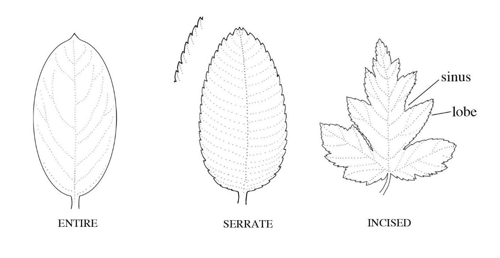

# Learning seedling identification

One of the most important elements in a Greenstand seedling photo is
the _species of plant_.  Different species have different
characteristics and are of different values for restoration
programs. Labeling an image with its plant species adds information
to the capture and builds training sets of images for machine
learning. Eventually it is our hope that automated image analysis will
be able to tag a photo with its species, but there is a lot of work to be done before then.

However recognizing species in photos is not easy, and requires
learning. Like during learning a language, you will be aware of very
little at first that might help you separate entities: you’ll see
green, leaves and stems. But over time you will learn to recognize
increasingly subtle differences, and will come to recognize species
you have seen before. This document is intended to guide you
efficiently through the learning process.

## Characters

A photo is a 2-dimensional representation of an organism in the
field. That organism has _characters_ that differ from organisms of
other species. In general, more closely related species have more
similar sets of characters.  Characters can be used to create
identification _keys_: e.g., “Question 1: if hairs on leaf underside
present, got to Question 2, if not, go to Question 3”, until a unique
combination of characters indicates that the organism is the
corresponding species. Many of the characters necessary for
discriminating species will not be visible in photographs, but we can
still search for some obvious characters in the image and that will
limit the set of species that it could be.  The short descriptions in
the ‘[virtual herbarium][1]’ may often explicitly mention some
characters or combinations of characters.

Learning a core set of eight characters will help you a lot:

 * Leaf arrangement on the stem
 * Petiole (leaf stalk) length
 * Leaf ‘compoundness’ (simple or compound)
 * Leaf size
 * Leaf shape
 * Leaf margin
 * Leaf vein patterns
 * Leaf color

Please read through the details of these characters, referring when
directed to the [virtual herbarium][1] for Haiti.  Note also that
there are lots of specialized terms for plant characters. You will
need to learn a few, but in this document and in the virtual herbarium
we will try to keep specialized vocabulary to a minimum.

### Leaf arrangement on the stem

The stalks of a plant’s leaves may join the stem in one of two basic
ways: they may meet separate from the stalks of other leaves, or they
may meet at the same point as one or more other other leaves. In the
former situation we say the leaves are “_alternate_”, in the latter
that they are “_opposite_”:

(Images taken with gratitude from from the [online][2] “Illustrated
Glossary of Botanical Terms in the Flora of the Chicago Region” by
Wilhelm & Rericha, 2017)

Often seeing the leaf arrangement is hard in an image crowded with
leaves, but usually there is at least a single instance where it can
be assessed.  Some examples in Haiti are:

 * Alternate
     * _Anacardium occidentale_
     * _Mangifera indica_
 * Opposite
     * _Catalpa longissima_
     * _Psidium guajava_

### Petiole (leaf stalk) length

At the base of the leaf is the leaf stalk that connects the leaf to
the stem. This stalk (“_petiole_”) can be long, relative to the length
of the leaf, or very short (termed “sessile”).  Check these plants out:

 * Petiole long
     * _Catalpa longissima_
     * _Theobroma cacao_
 * Petiole short (but not sessile)     
     * Indet. 2 (“Indet” means we do not know the species name yet)
     * _Terminalia catappa_ 

### Leaf ‘compoundness’ (simple or compound)

A leaf is a single structural unit, which will fall off when dead as
one. This unit is sometimes a compound structure with its own stalk
(“rachis”) and multiple leaf units called “_leaflets_”.  It can be tricky
to determine if what looks like a leaf is indeed a leaf, or just a
leaflet, but the regular structure of a “_compound_” leaf becomes
increasingly obvious as you get your eye in. The term “_simple_” is used
for a ‘classic’ single leaf.

There are several types of compound leaf, with the main division being
between “_pinnate_” leaves and “_palmate_” leaves. In the former,
there is a single extended stalk with leaflets coming off of it at
different points, while in the latter all the leaflets meet at a
single point.  A pinnate leaf may have a terminal leaflet
(odd-pinnate, or “_imparipinnate_”), or be without a terminal leaflet
(even-pinnate, or “_paripinnate_”).  One further complexity: if there
are two levels of division in a pinnate leaf, the leaf is “bipinnate”.

Some examples in Haiti:

 * Simple
    * _Anacardium occidentale_
    * _Mangifera indica_
 * Pinnate compound
    * _Cedrela odorata_
    * _Simarouba glauca_
 * Palmate compound
    * Indet. 3
 * Bipinnate
    * _Moringa oleifera_

### Leaf size

The size of seedling leaves (and leaflets) can be remarkably variable,
both on the same plant, and among plants of the same species in
different growing conditions. The size of seedling leaves is also
generally larger than the size of the leaves on an adult of the same
species. For this reason, we generally do not use leaf size
measurements as characters for these seedlings.  However, as you can
see from the images, there are some species that have strikingly
larger leaves than others, and so some times a general “leaves large”
or “leaves small” has been given.  For example:

 * Leaves large
    * _Artocarpus altilis_
 * Leaflets small
    * _Tamarindus indica_

### Leaf shape

Most leaves are some variation on elliptically shaped: narrow at the
base and narrow at the tip.  However the position of the widest part
of the leaf is an obvious and useful character, usually consistent
within a species. There are many terms to describe fine variation in
shape, but the terms that we will commonly use are: “_elliptic_” =
widest in the middle, “_ovate_” (egg-shaped) = widest towards the leaf
base, and “_obovate_” = widest towards the leaf tip.  Palm leaves are
shaped quite differently and often are referred to as “_linear_”.

Some examples in Haiti:

 * Elliptic
    * _Anacardium occidentale_
 * Ovate
    * __Catalpa longissima_
 * Obovate
    * _Terminalia catappa_
 * Linear
    * _Cocos nucifera_

### Leaf margin

The edge of a leaf’s blade (its “_margin_”) can be smooth, i.e.,
without teeth, or can be broken up in a variety of ways.  There are
many terms to describe the details of the teeth or incisions, but
three can be used to cover the majority of cases. An “_entire_” margin
is plain and even, a “_serrate_” margin has teeth, and an “_incised_”
margin has deep intrusions into the leaf. (Other terms you may read
are related to these: “dentate” is similar to serrate, and “lobed” is
similar to incised.) Sometimes the margin is wavy not in the 2-D plane
of the leaf surface but in a plane perpendicular to the margin, i.e.,
not flat; this is termed “_undulate_”, and can be hard to see in a
photo.

Most moist tropical species have entire leaves, with the incidence of
serrate leaves increasing in dry habitats and in temperate
floras. Some examples in Haiti:

 * Entire
    * _Mangifera indica_
 * Incised
    * _Artocarpus altilis_
 * Undulate
    * _Catalpa longissima_

### Leaf vein patterns

The veins of leaves can be hard to see in photos taken from above -
veins are usually clearer on the underside of the leaf. However, if
you can see them, they provide another consistent and useful set of
characters.  ‘Classic’ leaves have “_pinnate_” venation, while
maple-like leaves have “_palmate_” venation, with several main veins
meeting together at the base of the leaf. Grasses and palms, and few
other species, have veins that mainly run “_parallel_” to the main
axis of the leaf:

Examples in Haiti:

 * Pinnate venation
    * _Anacardium occidentale_
 * Parallel venation
    * _Acacia auriculiformis_
    * _Cocos nucifera_
 * Venation obscure
    * _Annona muricata_

### Leaf color

Finally, leaf color can be a useful character. Under different
lighting conditions the colors in photographs can be unreliable, and
it is difficult to describe colors. However, subconsciously you will
come to associate species with their color. Most leaves are obviously
some shade of green, but watch out for dark greens, pale greens,
bluish tinges, and grayish tinges.  Yellowish tinges are more often a
sign of nutrient deficiency than a characteristic of a species. Rarely
a species will have consistent “variegation”, with pale or yellowish
dots on a darker, greener surface.

Another feature of the leaf surface is its sheen. Some species have
consistently “glossy” surfaces, some are consistently “matte”. This may
be visible in photos, depending on the image’s lighting.

 * Darker
    * _Citrus_
    * _Simarouba glauca_
 * Paler
    * _Moringa oleifera_
 * Variegated
    * _Catalpa longissima_
 * Glossy
    * _Mangifera indica_

## Summary

As you learn these characters you will see that most tropical tree
species have simple, alternate, entire leaves with pinnate
venation. However, many species have at least one character that is
not the ‘usual’ one and this alone reduces the set of species you need
to consider. And as you learn the species, and see them commonly, your
subconscious will start to take over and you will not need to compare
their characters one-by-one between your image and the reference set.
Do however please always remember that the tropics are very diverse,
and there are often rare species that look very similar to a common
one you may know, differing only in minor ways, and so it is vital to
express uncertainly if you are not totally sure.

Thanks for you work on this, and I hope you will find it rewarding to
come to know tropical tree species.

[1]: https://herbarium.treetracker.org/guide/guide_ht.html
[2]: https://conservationresearchinstitute.org/forms/CRI-FLORA-Glossary.pdf

